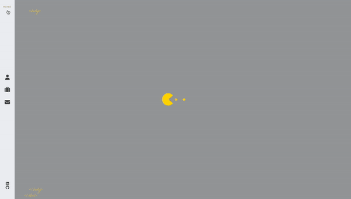

# Personal Website

[Objective](#Objective) | [Running the program](#running_the_program) | [Further work](#further_work)

This is the code behind my personal website, built from the ground up using React. You can visit it by [clicking here](https://ibrahim-pala.netlify.app)!

<div align="center"></div>

## <a name="objective">Objective</a>

To build a portfolio website using react native to pratice and showcase my skills.

## <a name="running_the_program">Running the program</a>

### Setup

To clone this repository onto your local device, to customize it to your liking, follow the steps below.
```
$ git clone https://github.com/jasylwong/my_website.git
$ cd my_website
$ npm install
$ npm start
````

## <a name="further_work">Further work</a>

- To add onto the tech stack on the about page and make the layout more aesthetically pleasing.
- Add more projects, both those already completed and those created in the future.
- Potentially make the sidebar buttons clearer.
